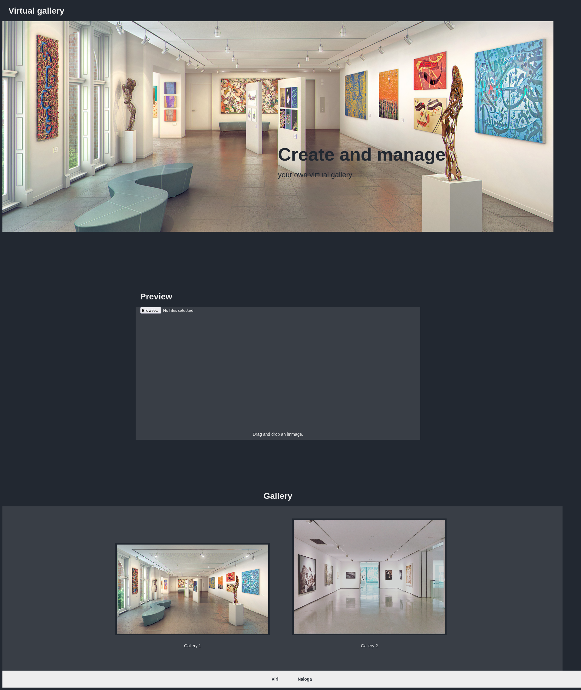

# Virtualna galerija

Pri predmetu spletne tehnologije sem za seminarsko nalogo naredil spletno stran na temo vrtualna galerija. Spletna stran omogoča prikaz uporabnikovih slik na enostaven način. Izdelana je s pomočjo HTML5, css in JavaScript. Med drugim uporablja tudi funkcionalnost HTML5 drag&drop.

